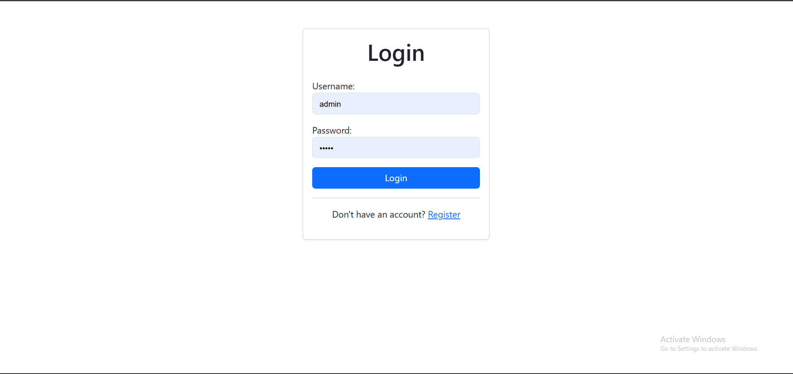
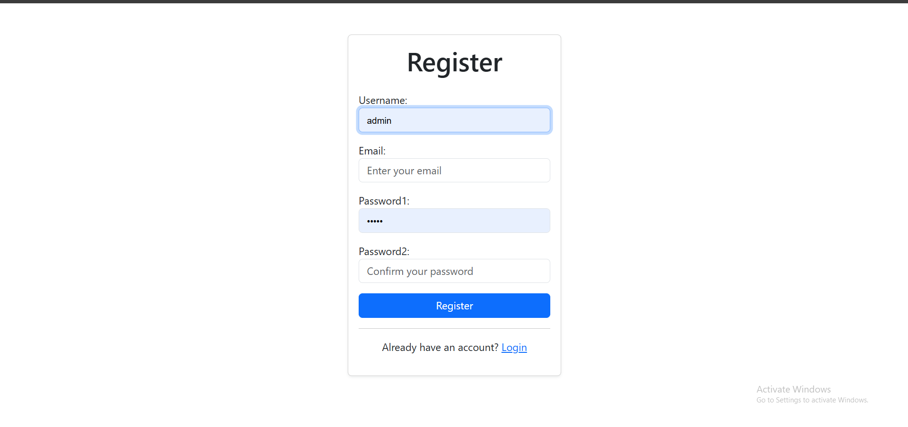
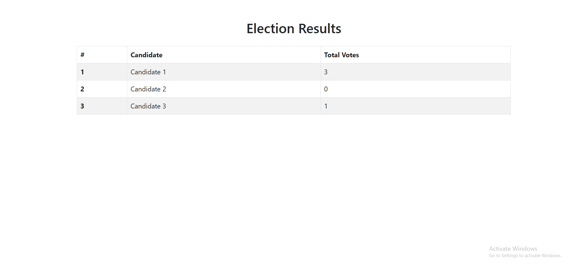

# Secure Vote App

A secure and efficient voting application built with Django, utilizing **Partially Homomorphic Encryption (Paillier)** and **Fernet Encryption** to ensure the confidentiality and integrity of votes.

## 📜 Features

- **Secure Voting Mechanism**: Votes are encrypted using a combination of Paillier and Fernet encryption.
- **Efficient Vote Counting**: Homomorphic addition of encrypted votes ensures no decryption is needed during intermediate calculations.
- **User Authentication**: Simple login and registration functionality for voters.
- **Transparency & Security**: Ensures vote secrecy while allowing accurate tallying.

## 🔒 How It Works

1. **Encryption Workflow**:
   - Each vote is encrypted using **Paillier encryption** (supports homomorphic addition).
   - The encrypted result is further encrypted with **Fernet encryption** for additional security.
   
2. **Storage**:
   - Votes are stored in the database in the doubly encrypted format (Paillier + Fernet).

3. **Vote Counting**:
   - When votes are counted:
     - Fernet encryption is removed first.
     - Homomorphic addition is performed directly on Paillier-encrypted votes.
     - The Paillier private key is used to decrypt the final tally, revealing the total votes for each candidate.

## 🛠️ Installation and Setup

1. **Clone the Repository**:
   ```bash
   git clone https://github.com/aalkann/Secure-Voting-System.git
   cd Secure-Voting-System
   ```

2. **Set Up Virtual Environment**:
   ```bash
      docker-compose up -d
   ```

7. **Access the App**:
   Visit `http://localhost:8000` in your web browser.


## 📸 Screenshots

- **Login Page**  
  

- **Register Page**  
  

- **Home Page**  
  

- **Result Page**  
  

